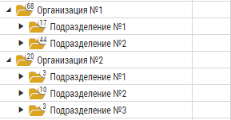
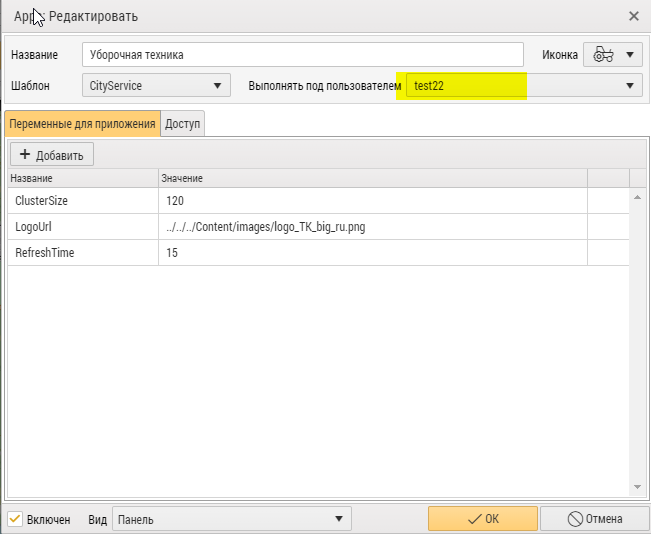
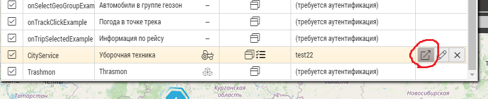

<br />
<p align="center">
  <a href="https://www.tk-nav.ru/">
    
  </a>

<h3 align="center">Инструкция по интеграции приложения на сайт</h3>


<!-- TABLE OF CONTENTS -->
<details open="open">
  <summary><h2 style="display: inline-block">Содержание</h2></summary>
  <ol>
    <li>
      <a href="#о-проекте">О модуле</a>
    </li>
    <li>
      <a href="#перед-началом">Перед началом</a>
      <ul>
        <li><a href="#установка">Установка</a></li>
      </ul>
    </li>
    <li><a href="#рекомендации">Рекомендации по использованию</a></li>
    <li><a href="#контакты">Контакты</a></li>
  </ol>
</details>

## О проекте

Данный модуль позволяет интегрировать App на внейшний сайт.

## Перед началом

Установите App по <a href="../readme.me">инструкции</a>.

### Установка

1. Создайте организацию, добавьте транспорт для наблюдения. Рекомендуемая иерархия - на первом уровне группы с организациями, в них вложены подразделения.

    

2. Добавьте пользователя в организацию.

3. В выпадающем списке "Выполнять под пользователем" выберите созданного пользователя. Убедитесь, что в закладке Доступ есть текущая организация.

    

4. Откройте App в отдельном окне.

    

5. Скопируйте адрес страницы и сохраните его в файл parameters.js
````js
var source = "вставьте путь к вашей странице сюда";
````
6. Поместите файлы index.html и parameters.js на ваш внешний сервер.

<!-- USAGE EXAMPLES -->

## Рекомендации по использованию

В целях безопасности и удобства для интеграции App'а рекомендуем использовать отдельную организацию и пользователя. 

<!-- CONTACT -->

## Контакты

E-mail: <a href="mailto:mail@tk-chel.ru">mail@tk-chel.ru</a>
