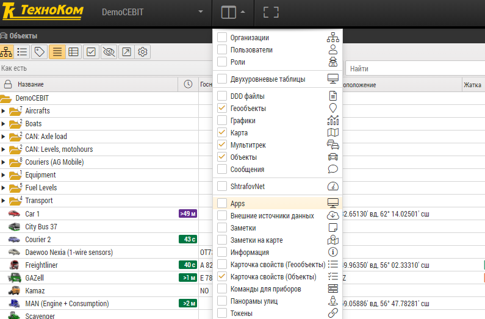
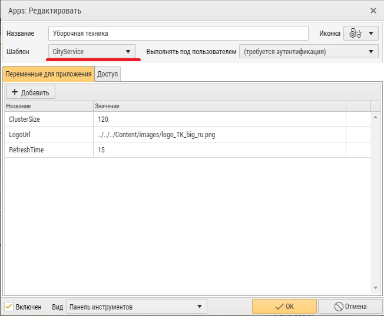
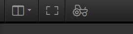

 

  

<h3 align="center">Приложение для отображения городской коммунальной техники</h3>

<!-- TABLE OF CONTENTS -->

  
<h2 style="display: inline-block">Содержание</h2>

  <ol>
    <li>
      <a href="#о-проекте">О проекте</a>
    </li>
    <li>
      <a href="#перед-началом">Перед началом</a>
      <ul>
        <li><a href="#установка">Установка</a></li>
      </ul>
    </li>
    <li><a href="#использование">Использование</a></li>
    <li><a href="#контакты">Контакты</a></li>
  </ol>

## О проекте

Данное приложение позволяет в онлайн-режиме наблюдать за группами транспорта на карте.

## Перед началом

Для работы примера нужен доступ к AutoGRAPH Web под учетной записью администратора.

### Установка

1. Скопируйте папку с App в AppTemplates

2. Зайдите в Apps

    

3. Добавьте новый App, выбрав шаблон CityService (Шаблон - название директории, в которой находится приложение).
   Если требуется, добавьте параметры ClusterSize (размер зоны в пикселях для группировки автомобилей), RefreshTime (
   интервал обновления положений автомобилей в секундах), LogoUrl (путь к логотипу компании), OutdatedTimeout (время в минутах, по истечению которого автомобиль считается offline), .

    

4. Перезагрузите страницу и включите App в меню

    

   или на панели инструментов.

   

5. Для интеграции на сайт воспользуйтесь <a href="integration/readme.md">инструкцией</a>.

<!-- USAGE EXAMPLES -->

## Использование

Выберите группу (организацию) и подгруппу (подразделение) автомобилей, все активные автомобили из группы будут
отображены на карте.

<!-- CONTACT -->

## Контакты

E-mail: <a href="mailto:mail@tk-chel.ru">mail@tk-chel.ru</a>
