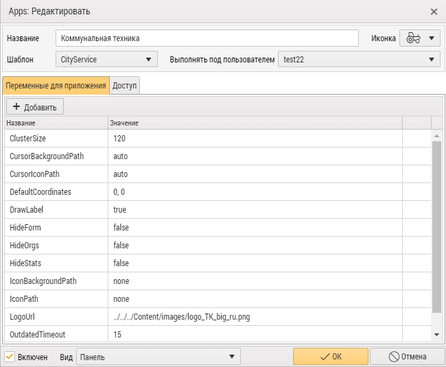

 

  

<h3 align="center">Приложение для отображения городской коммунальной техники</h3>

<!-- TABLE OF CONTENTS -->

  
<h2 style="display: inline-block">Содержание</h2>

  <ol>
    <li>
      <a href="#о-проекте">О проекте</a>
    </li>
    <li>
      <a href="#перед-началом">Перед началом</a>
      <ul>
        <li><a href="#установка">Установка</a></li>
      </ul>
    </li>
    <li><a href="#использование">Использование</a></li>
    <li><a href="#контакты">Контакты</a></li>
  </ol>

## О проекте

Данное приложение позволяет в онлайн-режиме наблюдать за группами транспорта на карте.

## Перед началом

Для работы примера нужен доступ к AutoGRAPH Web под учетной записью администратора.

### Установка

1. Скопируйте папку с App в AppTemplates

2. Зайдите в Apps

   

3. Добавьте новый App, выбрав шаблон **CityService** (Шаблон - название директории, в которой находится приложение).
   Если требуется, добавьте параметры **ClusterSize** (размер зоны в пикселях для группировки автомобилей), **
   RefreshTime** (
   интервал обновления положений автомобилей в секундах), **LogoUrl** (путь к логотипу компании), **OutdatedTimeout** (
   время в минутах, по истечению которого автомобиль считается offline), **CustomIcon** (путь к произвольной иконке
   автомобиля, ориентация иконки должна быть вверх). В случае отсутствия какого-либо из параметров, будут использоваться
   значения по умолчанию.

   

4. Перезагрузите страницу и включите App в меню

   

   или на панели инструментов.

   

5. Если требуется задать список геозон, при нахождении которых нужно исключить автомобиль из показа (например, гараж),
   зайдите в дизайнер параметров объекта, создайте новый слой геозон и выберите из списка все необходимые геозоны для
   исключения.

   

   Перейдите на закладку "Список параметров", добавьте новый параметр с именем **AppCityServiceVisible**, значением
   колонки Список "Финальные" и выражением вида **OutOfGFx**, где **x** - порядковый номер слоя. В указанном примере
   слой "Геозона простоя" второй по счету, поэтому используется выражение OutOfGF2.

   

   Вы можете задать любое выражение в параметре **AppCityServiceVisible**, используя произвольные условия для
   выставления флага отображения автомобиля.

   В случае отсутствия параметра **AppCityServiceVisible** автомобиль будет отображаться в любой геозоне.

6. Для интеграции на сайт воспользуйтесь <a href="integration/readme.md">инструкцией</a>.

<!-- USAGE EXAMPLES -->

## Использование

Выберите группу (организацию) и подгруппу (подразделение) автомобилей, все активные автомобили из группы будут
отображены на карте.

<!-- CONTACT -->

## Контакты

E-mail: <a href="mailto:mail@tk-chel.ru">mail@tk-chel.ru</a>
