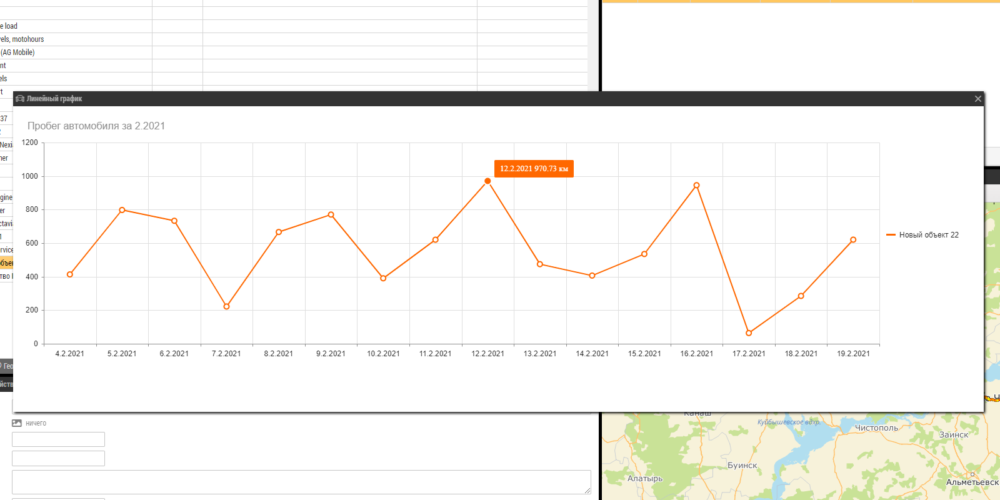
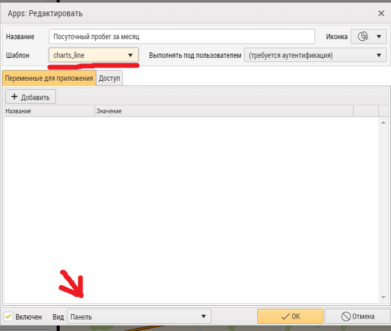

 

  

<h3 align="center">Демо-приложение для построения линейного графика суточного пробега за текущий месяц</h3>

  
 
        Демонстрация возможностей внешних App

<!-- TABLE OF CONTENTS -->

  
<h2 style="display: inline-block">Содержание</h2>

  <ol>
    <li>
      <a href="#о-проекте">О проекте</a>
    </li>
    <li>
      <a href="#перед-началом">Перед началом</a>
      <ul>
        <li><a href="#установка">Установка</a></li>
      </ul>
    </li>
    <li><a href="#использование">Использование</a></li>
    <li><a href="#контакты">Контакты</a></li>
  </ol>

## О проекте

Данный пример показывает, как можно использовать Kendo Charts для построения графиков по данным, взятым
из  [AutoGRAPH API](https://wiki.tk-chel.ru/index.php/AutoGRAPH.NET_Service_Methods). При выборе устройства возникает
событие <bold>onSelectCar</bold> и выполняется
запрос <a href="https://wiki.tk-chel.ru/index.php/AutoGRAPH.NET_Service_GetTrips">GetTripsTotal</a>, результат запроса
выводится на график.

## Перед началом

Для работы примера нужен доступ к AutoGRAPH Web под учетной записью администратора.

### Установка

1. Скопируйте папку с App в AppTemplates

2. Зайдите в Apps

    

3. Добавьте новый App, уделив внимание выделенным полям (Шаблон - название директории, в которой находится приложение).

    

4. Перезагрузите страницу и включите App в меню

    

<!-- USAGE EXAMPLES -->

## Использование

Выберите автомобиль из списка объектов, в окне приложения будет нарисован посуточный график пробега.

_Для других вариантов использования воспользуйтесь описанием
нашего [API](https://wiki.tk-chel.ru/index.php/AutoGRAPH.NET_Service_Methods)._

<!-- CONTACT -->

## Контакты

E-mail: <a href="mailto:mail@tk-chel.ru">mail@tk-chel.ru</a>