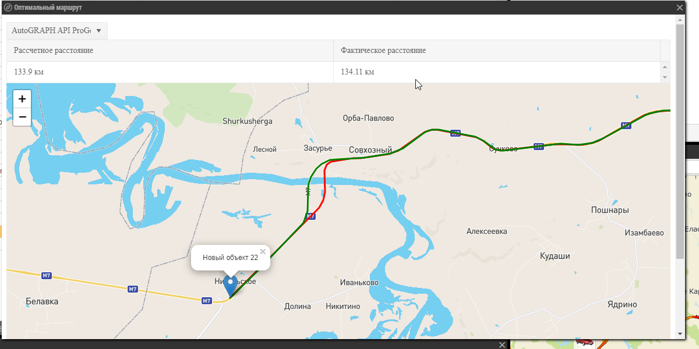
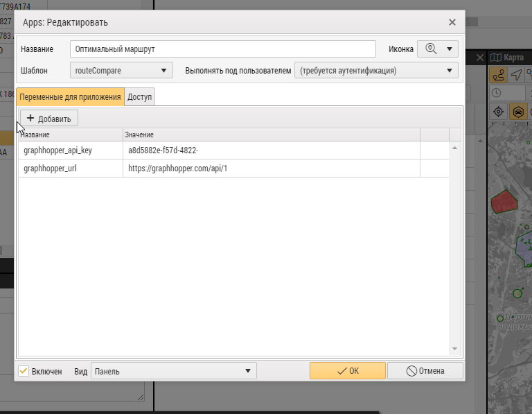

 

  

<h3 align="center">Демо-приложение для сравнения фактического маршрута с рассчетным, полученным из сторонних сервисов
построения маршрута</h3>

  
 
        Демонстрация возможностей внешних App

<!-- TABLE OF CONTENTS -->

  
<h2 style="display: inline-block">Содержание</h2>

  <ol>
    <li>
      <a href="#о-проекте">О проекте</a>
    </li>
    <li>
      <a href="#перед-началом">Перед началом</a>
      <ul>
        <li><a href="#установка">Установка</a></li>
      </ul>
    </li>
    <li><a href="#использование">Использование</a></li>
    <li><a href="#контакты">Контакты</a></li>
  </ol>

## О проекте

Данный пример показывает, как можно
использовать [AutoGRAPH API](https://wiki.tk-chel.ru/index.php/AutoGRAPH.NET_Service_Methods) для получения фактического
маршрута и сравнения его протяженности с рассчетным. При выборе устройства возникает событие onTripSelected и
выполняются запросы <a href="https://wiki.tk-chel.ru/index.php/AutoGRAPH.NET_Service_GetTrips">GetTrips</a>
, <a href="https://wiki.tk-chel.ru/index.php/AutoGRAPH.NET_Service_GetTrack">GetTrack</a>, в сторонний сервис рассчета
маршрута, результат сравнения выводится в таблицу, отрисованные маршруты на карту Leaflet.

## Перед началом

Для работы примера нужен доступ к AutoGRAPH Web под учетной записью администратора, api key для сторонних сервисов.

### Установка

1. Скопируйте папку с App в AppTemplates

2. Зайдите в Apps

    

3. Добавьте новый App, уделив внимание выделенным полям (Шаблон - название директории, в которой находится приложение).

    

4. Для использования сервиса построения маршрутов [Graphhopper](https://www.graphhopper.com/), зарегистрируйте в сервисе
   и добавьте ключи graphhopper_url со значением "https://graphhopper.com/api/1" и graphhopper_api_key
   со [значением вашего ключа API](https://graphhopper.com/dashboard/#/apikeys).

   

5. Перезагрузите страницу и включите App в меню

    

<!-- USAGE EXAMPLES -->

## Использование

Выберите рейс из списка рейсов, желаемый сервис API для построения маршрута, результат будет выведен на форму.

_Для других вариантов использования воспользуйтесь описанием
нашего [API](https://wiki.tk-chel.ru/index.php/AutoGRAPH.NET_Service_Methods)._

<!-- CONTACT -->

## Контакты

E-mail: <a href="mailto:mail@tk-chel.ru">mail@tk-chel.ru</a>
